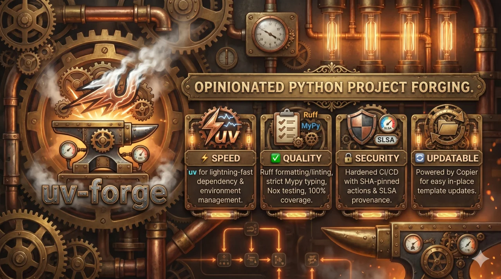

# uv-forge



A [Copier](https://copier.readthedocs.io/) template for forging modern, opinionated Python
projects at high speed: [uv](https://docs.astral.sh/uv/) for everything,
[Ruff](https://docs.astral.sh/ruff/), strict [mypy](https://mypy.readthedocs.io/) (plus
[ty](https://github.com/astral-sh/ty)), [nox](https://nox.thea.codes/), 100% coverage, and a
hardened, SHA-pinned GitHub Actions setup with SLSA build provenance.

Unlike cookiecutter, Copier supports in-place updates — generated projects can pull in template
improvements later with `copier update`.

## Quick start

```console
uvx --with jinja2-time copier copy --trust gh:bosd/uv-forge path/to/your-project
```

uv-forge is the successor to
[cookiecutter-uv-hypermodern-python](https://github.com/bosd/cookiecutter-uv-hypermodern-python),
and is released under the **MIT license**.

```{toctree}
:maxdepth: 1
:caption: Contents

overview
getting-started
options
whats-included
nox-sessions
external-services
releasing
updating
contributing
Changelog <https://github.com/bosd/uv-forge/releases>
```
